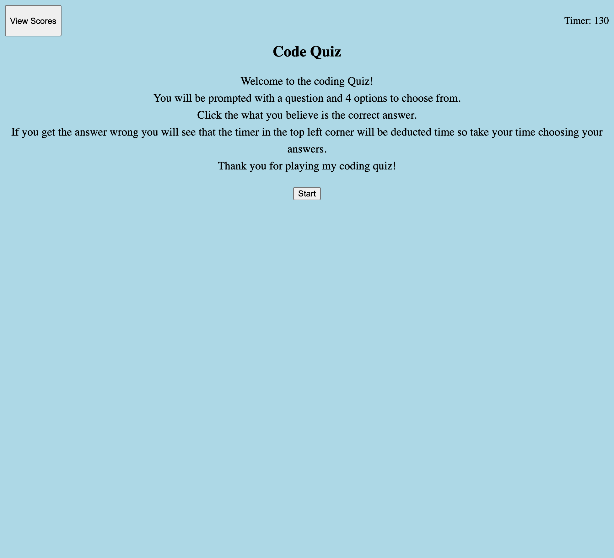

# Coding-Quiz

## Description
The purpose of this code was to create a coding quiz where the user could test their knowledge. I created the code to have the acceptance criteria below.

### Acceptance Criteria
GIVEN I am taking a code quiz
- WHEN I click the start button
THEN a timer starts and I am presented with a question

- WHEN I answer a question
THEN I am presented with another question

- WHEN I answer a question incorrectly
THEN time is subtracted from the clock

- WHEN all questions are answered or the timer reaches 0
THEN the game is over

- WHEN the game is over
THEN I can save my initials and score

## Live URL

https://caballero-r.github.io/Coding-Quiz/

## Resources
1. Module 4 Web APSs Challenge - Code Quiz: https://courses.bootcampspot.com/courses/3173/assignments/50864?module_item_id=920592
2. HTML DOM Events: https://www.w3schools.com/jsref/dom_obj_event.asp 
3. Tutoring Session with Jaytee Padilla: Provided direction and initial structure of HTML, CSS, and JavaScript
4. JavaScript Resources: https://www.w3schools.com/js/default.asp, https://developer.mozilla.org/en-US/docs/Web/JavaScript, 

## Contributors
1. caballero-r
2. Jaytee Padilla (Tutor)
